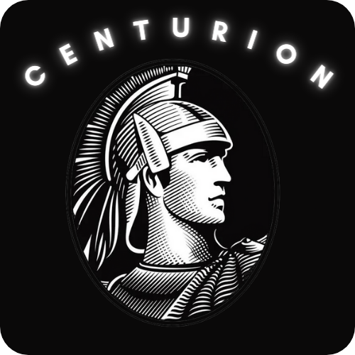

<!-- PROJECT LOGO -->
 

  

  <h3 align="center">Project Module 238</h3>

  

    Website for Module 238 
     
     
    <a href="https://centurioninc.netlify.app/">Visit the website</a>
    ·
  

<!-- ABOUT THE PROJECT -->
## About The Project

The goal of this project was to learn HTML and CSS and to be able to create a site on a theme that we like or that we are passionate about. 

Here are the characteristics that we must have on the site:
* -
* -
* -

### Built With
I was able to create this site thanks to these technologie :
* [HTML5](https://fr.wikipedia.org/wiki/HTML5)
* [CSS](https://en.wikipedia.org/wiki/CSS)
* [JS](https://www.javascript.com/)

<!-- GETTING STARTED -->
## Getting Started

To be able to download this project it's very simple, you just have to clone it with the git command or download it in zip directly, no additional download is necessary. 

You can launch it with the "Live Server" addon on Visual Studio Code 

<!-- LICENSE -->
## 📝 License
Describe your License for your project. 

Distributed under the MIT License. See `LICENSE` for more information.

<!-- CONTACT -->
## 📫 Contact

My Instagram [@ruben4reall](https://instagram.com/ruben4reall)
 My Discord [soonrich#0000] (https://discord.gg/ctri)

Project Link: [https://github.com/ruben4reall/Projet-For-School-Module-293](https://github.com/ruben4reall/Projet-For-School-Module-293)

<!-- SOURCES -->
## 🔗 Sources
-